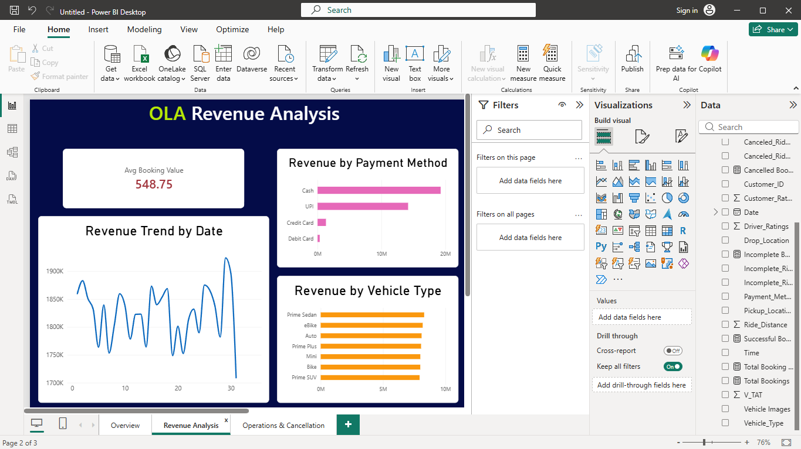

# OLA Rides Data Analysis Project

## 📊 Project Overview

This project analyzes OLA ride booking data to understand booking performance, revenue, cancellations, incomplete rides, customer ratings, and vehicle-wise performance.

The project combines SQL analysis with an interactive Power BI dashboard to convert raw booking data into meaningful business insights.

## 🎯 Project Objectives

- Analyze overall OLA booking performance
- Understand successful, cancelled, and incomplete bookings
- Analyze revenue by payment method and vehicle type
- Compare customer and driver cancellations
- Analyze incomplete ride reasons
- Compare customer ratings across vehicle types
- Analyze booking value and ride distance
- Create an interactive Power BI dashboard

## 🛠️ Tools & Technologies

- SQL / MySQL
- Power BI
- CSV Dataset
- GitHub

## 🔍 SQL Analysis

The SQL analysis covers:

- Successful bookings
- Vehicle-wise ride distance
- Customer and driver cancellations
- Top customers
- Customer ratings
- Driver-related issues
- Payment methods
- Booking value
- Incomplete rides and their reasons

SQL queries are available in:

`OLA_Solved_Query_MySQL.sql`

## 📈 Power BI Dashboard

The dashboard contains three main sections:

### 1. Overall Performance

- Total Bookings
- Successful Bookings
- Cancelled Bookings
- Incomplete Bookings
- Total Booking Value
- Average Customer Rating
- Average Ride Distance
- Booking Status Distribution
- Bookings by Vehicle Type

### 2. Revenue Analysis

- Average Booking Value
- Revenue by Payment Method
- Revenue by Vehicle Type
- Revenue Trend by Date

### 3. Operations & Cancellations

- Incomplete Ride Reasons
- Cancellations by Customer vs Driver
- Average Customer Rating by Vehicle Type
  
## 📸 Dashboard Preview

### Overall Performance

### Revenue Analysis

### Operations & Cancellations

## 📁 Project Files

| File | Description |
|---|---|
| `Bookings_ola.csv` | OLA ride booking dataset |
| `OLA_Solved_Query_MySQL.sql` | SQL analysis queries |
| `OLA_RIDES_DATA_REPORT_PROJECT.pbix` | Power BI dashboard |
| `OLA_Dashboard_Screenshots/` | Dashboard screenshots |

## 🚀 Project Outcome

This project demonstrates the use of SQL and Power BI for data analysis, visualization, and business insight generation from ride booking data.

## 👨‍💻 Author

**Utkarsh Tiwari**

B.Tech – Computer Science & Engineering

Aspiring Data Analyst
